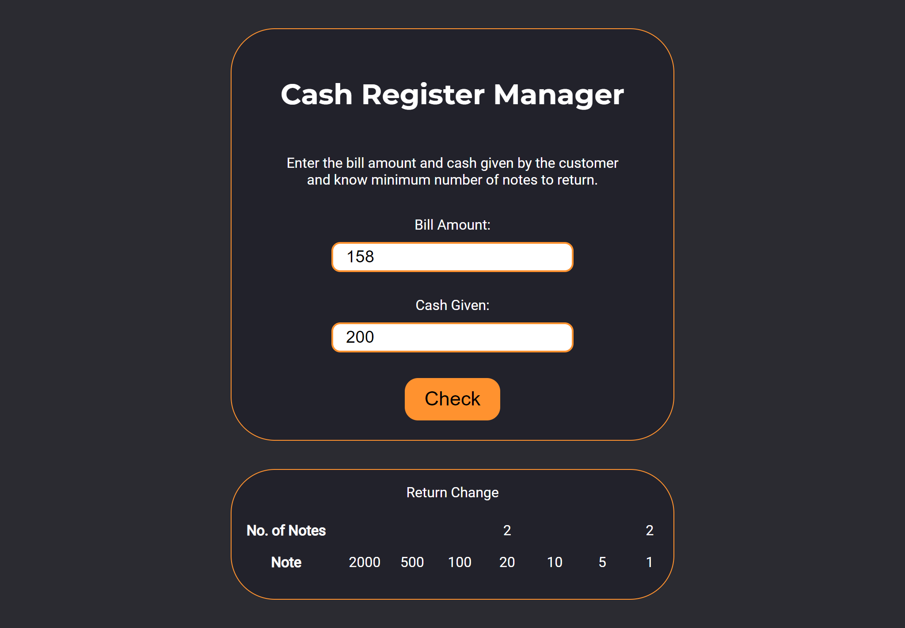

# Cash Register App

An app that calculates the change to be returned. It takes the bill amount and cash given by the customer as the input and calculates the least number of notes to be returned. Then displays the number of notes to be returned in a table.

## Overview

### Screenshot



### Links

- Live Site URL: [cash-register-darshan.netlify.app/](https://cash-register-darshan.netlify.app/)

## My process

### Built with

- HTML
- CSS
- JavaScript

### What I learned

Understood how to create a table in HTML.

```html
<table>
  <caption>
    Return Change
  </caption>
  <tr>
    <th>No. of Notes</th>
    <td></td>
  </tr>
  <tr>
    <th>Note</th>
    <td>2000</td>
    <td>500</td>
    <td>100</td>
    <td>20</td>
    <td>10</td>
    <td>5</td>
    <td>1</td>
  </tr>
</table>
```

These functions given below are the most used funtions. They can be used to show output, to show or hide error messages. At first I was not using these functions to set display property and after writing the same code for couple different, I thought I should make this into a funtion. And it has been very helpful.

```js
const show = (element) => {
  return (element.style.display = "block");
};

const hide = (element) => {
  return (element.style.display = "none");
};
```

## Author

- Twitter - [@DarshanDamre](https://twitter.com/DarshanDamre)
- LinkedIn - [Darshan Damre](https://www.linkedin.com/in/darshandamre/)
- Website - [Darshan Damre](https://darshandamre.netlify.app/)
